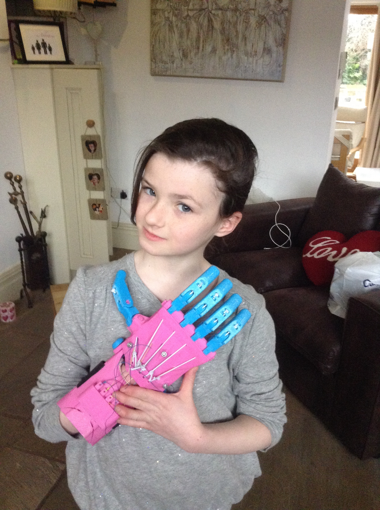

# DesktopProsthetics
### 4th June - 31st August 2015 at [FACT](http://fact.co.uk/projects/build-your-own-tools-for-sharing.aspx?when=futureevents)
**Gallery 1, FACT, 88 Wood Street, Liverpool, L1 4DQ**

Image Copyright Jason Abbott.
### Copy:

###[DoESLiverpool](http://doesliverpool.com "DoESLiverpool's Homepage") will develop an iteration of the [Enabling the Future](http://enablingthefuture.org/upper-limb-prosthetics/the-raptor-hand/ "Enabling The Future Website") project within the Build Your Own Show at FACT. DoESLiverpool is a community of makers and entrepreneurs in Liverpool, with a Co-Working space, Workshop and Event Hub. It’s a place to work, learn, share ideas, form groups and make things the way you want to for small fees or initially, cake.

###DoES will be lead creative technologists to help setup, facilitate and support a ‘production line’ area for Build Your Own introducing the idea of 3D printing open source designs of upper limb prosthetics. It's inspired by a local family who used DoESLiverpool's workshop to print hand parts independently.

###Over the course of the exhibition FACT Gallery Assistants and DoESLiverpool will assist the public in testing and building 3D printed prosthetic devices. The public will have the opportunity to play, experiment and understand what prosthetics are and how access to rapid prototyping and open source digital making tools can help people make the world the way they want it.

### Information:
Project mgmt and help files for 3D printed prosthetic hand project

This repo has 
* [Issues](https://github.com/cheapjack/buildyourown/issues "github issues for the project") to aid @cheapjack @amcewen and @defproc management of the project and information
* [copy as README.md files](https://github.com/cheapjack/buildyourown/tree/master/events) for publicity in the events folder
* Other useful info like model parts

We are also collecting related information - links, pictures, etc. - over on the [Desktop Prosthetics tumblr](http://desktopprosthetics.tumblr.com/)

### Issues:

The issue list is a place to track what needs to be done.  Creating and closing them is cheap, so make liberal use of them :-)

It's easy to see which issues need addressing by looking at the [open issue list](https://github.com/cheapjack/buildyourown/issues) but there are other ways to slice and dice things.  Issues get [labelled](https://github.com/cheapjack/buildyourown/labels) as a way to group them together - feel free to create new labels as and when needed.  And there are a few [milestones](https://github.com/cheapjack/buildyourown/milestones) to mark when issues have to be finished.  Use milestones for things that '''have''' to be done before a set event, rather than for "it'd be lovely if this was done by date X", as that just clutters things up if the deadline isn't hit.

Some more useful labels:
 * [Exhibits](https://github.com/cheapjack/buildyourown/labels/Exhibits)  Anything relating to the exhibits themselves
 * [Graphics](https://github.com/cheapjack/buildyourown/labels/Graphics)  Anything relating to the wall text, images, and data visualisation
 * [Set design](https://github.com/cheapjack/buildyourown/labels/Set%20design)  Issues relating to the 3d design of the exhibition
 * [Liverpool](https://github.com/cheapjack/buildyourown/labels/Liverpool)  Anything related specifically to the exhibition at FACT
 * [Norwich](https://github.com/cheapjack/buildyourown/labels/Norwich)  Anything related specifically to the exhibition at Norwich Castle

For some more background on good practice when using issues, read http://ben.balter.com/2014/11/06/rules-of-communicating-at-github/.  It's about Github's culture and process rather than exactly how we're running things, but there's plenty of crossover.
